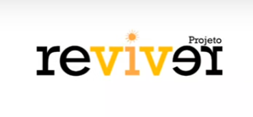

<!-- Improved compatibility of back to top link: See: https://github.com/othneildrew/Best-README-Template/pull/73 -->

<!--
*** Thanks for checking out the Best-README-Template. If you have a suggestion
*** that would make this better, please fork the repo and create a pull request
*** or simply open an issue with the tag "enhancement".
*** Don't forget to give the project a star!
*** Thanks again! Now go create something AMAZING! :D
-->

<!-- PROJECT LOGO -->
 

  

<h3 align="center">Project RevParkinson</h3>

  

    Mobile application to help Parkinson's disease patients treatment and provide more quality of life
     
    <a href="https://github.com/renanr0cha/reviver"><strong>Explore the docs »</strong></a>
     
     
    <a href="https://www.youtube.com/watch?v=A96sCZKOa9Y&list=PLBa-HK19NIneWzYEasD6xhbNWtao82FUF">View Demo Videos (Portuguese)</a>
    ·
    <a href="https://github.com/renanr0cha/reviver/issues/new?labels=bug&template=bug-report---.md">Report Bug</a>
    ·
    <a href="https://github.com/renanr0cha/reviver/issues/new?labels=enhancement&template=feature-request---.md">Request Feature</a>
  

<!-- TABLE OF CONTENTS -->

  
Table of Contents

  <ol>
    <li>
      <a href="#about-the-project">About The Project</a>
      <ul>
        <li><a href="#built-with">Built With</a></li>
      </ul>
    </li>
    <li>
      <a href="#getting-started">Getting Started</a>
      <ul>
        <li><a href="#installation">Installation</a></li>
      </ul>
    </li>
    <li><a href="#contact">Contact</a></li>
  </ol>

<!-- ABOUT THE PROJECT -->
## About The Project

[![Product Name Screen Shot][product-screenshot]](https://www2.unifap.br/reviver)

This app is being used in a pilot program to help improve the quality of life of Parkinson's disease patients and their caretakers. It has features like:

* Option to add medications they take, and the correct hour and dosage to take, providing local notifications to them when it's time to take the medicine
* Notifications when the medication is about to run out and they need to get more
* Access to caretakers to input information about their patients and also see their current state
* Forms to inform on their current state (emotional and physical) as well as symptoms that they are experiencing according to the UPDRS (Unified Parkinson's Disease Rating Scale), to help keep track of their well-being
* Charts showing their caretakers the state and evolution of symptoms of the patient
* Clean and informative UI
* User experience tailored to users with more advanced age and their caretakers

The app is <a href="https://drive.google.com/file/d/1JoYfwKquL7viBzH9mUWFBSVkLeK4fMNM/view?usp=drivesdk">registered in Brazil</a>, so all rights are reserved.

  

(<a href="#readme-top">back to top</a>)

### Built With

* [![React Native][ReactNative]][React-url]
* [![Typescript][Typescript]][Typescript-url]
* Native Base
* Expo
* Expo Local Notifications
* React Context
* React Hook Forms + Yup
* React Navigation
* Async storage

(<a href="#readme-top">back to top</a>)

<!-- CONTACT -->
## Contact

Renan Rocha - [Linkedin](https://www.linkedin.com/in/renanr0cha/) - renanrochadev@gmail.com

Project Link: [https://github.com/renanr0cha/reviver](https://github.com/renanr0cha/reviver)

(<a href="#readme-top">back to top</a>)

<!-- MARKDOWN LINKS & IMAGES -->
<!-- https://www.markdownguide.org/basic-syntax/#reference-style-links -->
[contributors-shield]: https://img.shields.io/github/contributors/renanr0cha/reviver.svg?style=for-the-badge
[contributors-url]: https://github.com/renanr0cha/reviver/graphs/contributors
[forks-shield]: https://img.shields.io/github/forks/renanr0cha/reviver.svg?style=for-the-badge
[forks-url]: https://github.com/renanr0cha/reviver/network/members
[stars-shield]: https://img.shields.io/github/stars/renanr0cha/reviver.svg?style=for-the-badge
[stars-url]: https://github.com/renanr0cha/reviver/stargazers
[issues-shield]: https://img.shields.io/github/issues/renanr0cha/reviver.svg?style=for-the-badge
[issues-url]: https://github.com/renanr0cha/reviver/issues
[license-shield]: https://img.shields.io/github/license/renanr0cha/reviver.svg?style=for-the-badge
[license-url]: https://github.com/renanr0cha/reviver/blob/master/LICENSE.txt
[linkedin-shield]: https://img.shields.io/badge/-LinkedIn-black.svg?style=for-the-badge&logo=linkedin&colorB=555
[linkedin-url]: https://linkedin.com/in/renanr0cha
[product-screenshot]: reviverss.jpg
[Next.js]: https://img.shields.io/badge/next.js-000000?style=for-the-badge&logo=nextdotjs&logoColor=white
[Next-url]: https://nextjs.org/
[ReactNative]: https://img.shields.io/badge/React_Native-20232A?style=for-the-badge&logo=react&logoColor=61DAFB
[React-url]: https://reactnative.dev/
[Typescript]: https://img.shields.io/badge/TypeScript-007ACC?style=for-the-badge&logo=typescript&logoColor=white
[Typescript-url]: https://www.typescriptlang.org/
[Vue.js]: https://img.shields.io/badge/Vue.js-35495E?style=for-the-badge&logo=vuedotjs&logoColor=4FC08D
[Vue-url]: https://vuejs.org/
[Angular.io]: https://img.shields.io/badge/Angular-DD0031?style=for-the-badge&logo=angular&logoColor=white
[Angular-url]: https://angular.io/
[Svelte.dev]: https://img.shields.io/badge/Svelte-4A4A55?style=for-the-badge&logo=svelte&logoColor=FF3E00
[Svelte-url]: https://svelte.dev/
[Laravel.com]: https://img.shields.io/badge/Laravel-FF2D20?style=for-the-badge&logo=laravel&logoColor=white
[Laravel-url]: https://laravel.com
[Bootstrap.com]: https://img.shields.io/badge/Bootstrap-563D7C?style=for-the-badge&logo=bootstrap&logoColor=white
[Bootstrap-url]: https://getbootstrap.com
[JQuery.com]: https://img.shields.io/badge/jQuery-0769AD?style=for-the-badge&logo=jquery&logoColor=white
[JQuery-url]: https://jquery.com 
